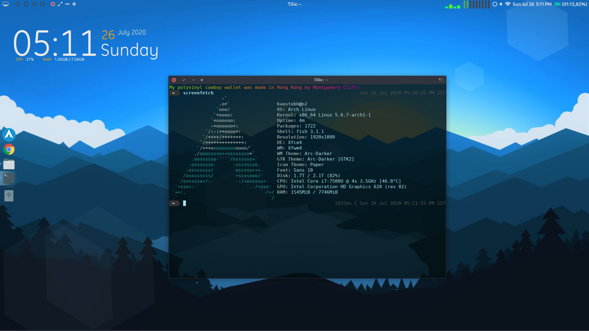

# dotfiles

Attempting to log config files. Mostly [fish functions](fish/functions/)

## Sync checklist
```
sh scripts/brew-export.sh
# fish functions
# git config
```


## Note: Linux
I used Linux (ubuntu, arch linux) until July 2020, before migrating to Mac. Config files for linux are available on the [linux branch](https://github.com/kaustubhhiware/dotfiles/tree/linux)
