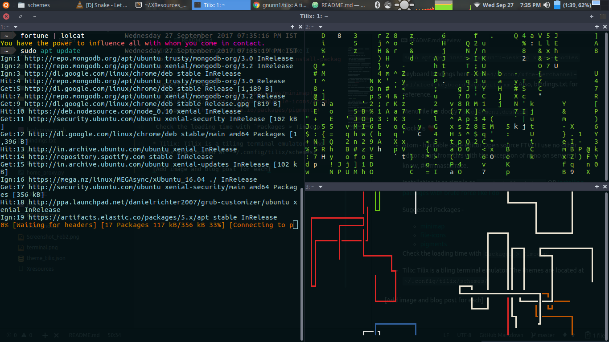

# dotfiles
Because dotfiles were getting quite a handful to manage. Here is a collection of my well-documented dotfiles, listing all sources and alternatives.

All .config files needed for UI and UX.

Write a file to sync all the files by themselves.
Configs to add:
* etc/environment
* fish [remove bash]
* xfce4, xfce4-session.
* tilix
* rofi, xterm => ~/.XResources
* polybar TO ADD
* .config ->
* .atom
* sublime in .config

Proxy settting in `_etc_environment`

* Themes and all can be known from `screenshot.png`
* lock screen image - `elementary.jpg`
* xfce window icon - `ubuntu_flat.png`

 Preferably keep these files in some location like - `/usr/share/backgrounds` or `/usr/share/icons`

 Add show desktop, remove docky icon. Settings still accessible from split in window.

* Terminal theme loosely based on solarised dark -

 Foreground text - `#ACE6ED`
 Background - `#020F12`

* No reason to use anything apart from xfce desktop. Low on resources, consumes upto 700 MB RAM on start, against 1.1 GB in Unity.[Config files from ~/.config/xfce4/](xfce4/)

 Install xfce desktop -

 `sudo apt-get install xubuntu-desktop  xfce4-goodies`

 Keyboard bindings here - `xfce4/xfconf/xfce-perchannel-xml/xfce4-keyboard-shortcuts.xml`. Also, bindings.txt for reference.

 Menu file for docky - `xfce4/menu.desktop`

* Docky is :heart:

* Atom - hackable code editor
 Open source FTW ! I use no other editor apart from this with the exception of nano on servers.
 I know, #vimmasterrace.

 Installation is as simple as `apm install minimap`
 OR
 [Installing packages with brute force like I do](https://discuss.atom.io/t/manually-install-package/9251/14)

 Suggested Packages -
 * [minimap](https://atom.io/packages/minimap)
 * [file-icons](https://github.com/file-icons/atom)
 * [pigments](https://atom.io/packages/pigments)

 Check the loading time with `Packages > Timecop`

* [Tilix](https://github.com/gnunn1/tilix): Tilix is a tiling terminal emulator. The themes are located at `~/.config/tilix/schemes/`

 

 As you can see, the left terminal is running update, right top is running [cmatrix](https://github.com/abishekvashok/cmatrix), and bottom right is [pipes.sh](https://github.com/pipeseroni/pipes.sh)

* [Rofi](https://github.com/DaveDavenport/rofi/) : Rofi, like dmenu, will provide the user with a textual list of options where one or more can be selected. This can either be, running an application, selecting a window or options provided by an external script.

https://github.com/DaveDavenport/rofi-themes
https://github.com/DaveDavenport/rofi/wiki/rofi-manpage

 Config file is .XResources.

 Using it: `xrdb ~/.XResources`. Ready to use with `rofi -show run`. I've configured with as a shortcut as _Win + R_.
http://terminal.sexy/
https://www.reddit.com/r/unixporn/comments/32pjq3/how_do_i_get_those_pretty_terminals/

[Add image and blog post for each]
