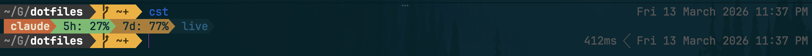
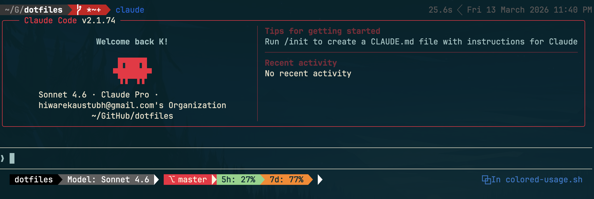

# claude

I've gone all in on claude now.

Made this custom fish function for color coded claude usage [../fish/functions/cst.fish](../fish/functions/cst.fish).

Claude session looks like this, git branch shows status like [fish's bobthefish](https://github.com/oh-my-fish/theme-bobthefish).

Needs [ccstatusline](https://github.com/sirmalloc/ccstatusline).
