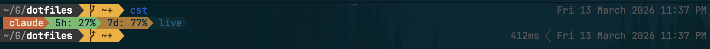
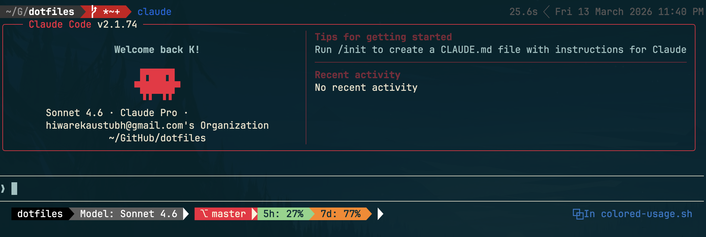

# claude

I've gone all in on claude now.

Made this custom fish function for color coded claude usage [../fish/functions/cst.fish](../fish/functions/cst.fish).

Claude session looks like this, git branch shows status like [fish's bobthefish](https://github.com/oh-my-fish/theme-bobthefish).
The following images shows 3 states: git clean, git staged and git dirty.

Needs [ccstatusline](https://github.com/sirmalloc/ccstatusline).

## Skills list

- [atomic-commits](skills/atomic-commits/): Splits the changes of a branch into commits that build alone.
- [coding-principles](skills/coding-principles/): Keeps code changes small, simple, and inside the goal.
- [describe-pr](skills/describe-pr/): Fills the pull request template of the repository and applies it with `gh pr edit`.
- [design-taste-frontend](skills/design-taste-frontend/): Builds web interfaces with strict rules for layout, motion, and density.
- [frontend-design](skills/frontend-design/): Writes production frontend code that does not look like generic AI output.
- [frontend-slides](skills/frontend-slides/): Makes HTML presentations in one file, with no build tools.
- [fullstack-guardian](skills/fullstack-guardian/): Builds a feature across the frontend, the backend, and the data flow between them.
- [golang-pro](skills/golang-pro/): Writes Go code for concurrency, gRPC, and microservices. This folder has only a README file, so Claude cannot load it as a skill.
- [omc-reference](skills/omc-reference/): Holds the OMC catalog of agents, tools, and teams. Claude loads it, the user cannot.
- [python-pro](skills/python-pro/): Writes Python 3.11+ code with type hints, async, and pytest.
- [react-expert](skills/react-expert/): Writes React 18+ components, hooks, and state management.
- [remember](skills/remember/): Adds one rule to the global `~/.claude/CLAUDE.md` file.
- [security-reviewer](skills/security-reviewer/): Audits code and infrastructure for security problems.
- [simple-english](skills/simple-english/): Rewrites technical text with the 53 rules of ASD-STE100.
- [slides-preferences](skills/slides-preferences/): Gives my personal slide rules. Load it with `frontend-slides`.
- [the-fool](skills/the-fool/): Attacks a plan or a decision to find the weak parts.
- [tra](skills/tra/): Translates text between English and Japanese. Runs only on `/tra`.
- [writing-style](skills/writing-style/): Gives my tone and format rules for blog posts.
