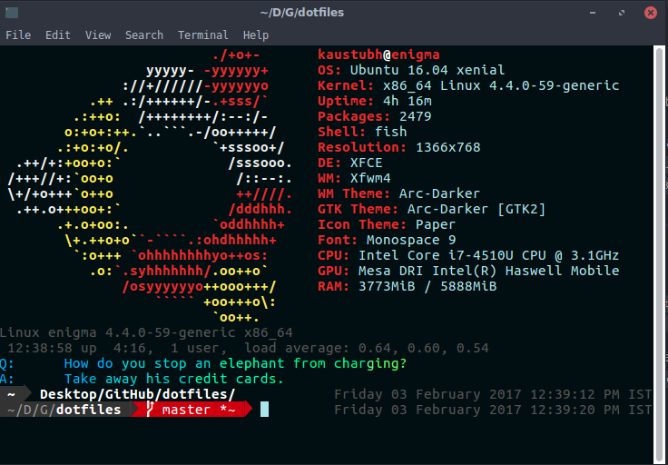

# fish

A user friendly command line shell . Read more about it [here](https://github.com/kaustubhhiware/awesome-ubuntu/#customising-terminal) for some resources.

Go to github > bobthefish and install nerdy fonts.

I've recently updated my [Notifyre](https://github.com/kaustubhhiware/NotiFyre)
project to support fish functionality. I use it for all commands, but may use it
for specific functions as well. You can see a demo image [here](thumbnail_fish.png)

`fisherman` folder placed here

The default location is ` ~/.config/fish/config.fish`

### Functions -

* `bandkar` - sudo shutdown now
* `cavabar` - run cava on a transparent terminal
* `clearcache` - clear cache memory
* `delete_branch` - delete feature branch, locally and remotely
* `fuggit` - remove redundant .pack files, reduce git folder size
* `ga` - git add
* `gc` - git commit [gc -m "Message"]
* `gd` - git diff
* `gst` - git status
* `level` - Print all files, upto a certain depth. See below.
* `list` - list all dirs in folder with sizes.
* `Muriel` - launch [Muriel](https://github.com/OrkoHunter/Muriel)

* `nf` - Notifies how much time a process took, and in which dir it is being used.
* `plsfind` - find for a file in recently modified - ex : `plsfind 1000 funcads` searches for funcads in last 1000 modified files
* `sizeof` - Print size of folder.
* `squash 2` - Squash 2 commits git.
* `utha` - simplified clone
* `visbar` - run cli-visualiser on transparent terminal.
* `unlock` - remove lock that blocks update, install, upgrade
* `waapas` - sudo reboot [Although sudo not needed ]
* `whatis` - print description of a fish function

**Note** : fish has 1-based indexing, see *functions/plsfind.fish* as an example.

### Screenshot
A newly launched terminal looks like this.



 ```
 > level 2 # for this repo
 .
├── [4.0K]  bash/
│   ├── [4.0K]  images/
│   ├── [4.0K]  bashrc*
│   └── [2.4K]  netcheck*
├── [4.0K]  cava/
│   ├── [4.5K]  config
│   ├── [5.3K]  config.1
│   ├── [4.5K]  config.save
│   ├── [4.5K]  default
│   ├── [4.5K]  mod_config
│   ├── [  35]  README.md
│   └── [   0]  terminix.dconf
├── [4.0K]  conky/
│   ├── [439K]  conky.png
│   └── [1.1K]  Gotham
├── [4.0K]  docky-2/
│   ├── [4.0K]  Docky/
│   └── [   0]  %gconf.xml*
├── [4.0K]  fish/
│   ├── [4.0K]  completions/
│   ├── [4.0K]  conf.d/
│   ├── [4.0K]  fisherman/
│   ├── [4.0K]  functions/
│   ├── [2.0K]  config.fish*
│   ├── [2.2K]  fishd.enigma
│   ├── [ 159]  fishfile
│   ├── [1.4K]  README.md*
│   ├── [103K]  Screenshot_Feb2.png
│   └── [234K]  thumbnail_fish.png
├── [4.0K]  images/
│   └── [329K]  tilix.png
├── [4.0K]  polybar/
│   ├── [ 18K]  config
│   └── [438K]  Screenshot_2017-11-23_12-06-27.png
├── [4.0K]  vis/
│   └── [3.8K]  config
├── [4.0K]  xfce4/
│   ├── [4.0K]  xfconf/
│   ├── [ 186]  menu.desktop*
│   └── [7.4K]  ubuntu_flat.png
├── [10.0K]  bash-preexec.sh*
├── [ 410]  bindings.txt
├── [ 223]  cava.sh*
├── [360K]  elementary.jpg*
├── [ 227]  _etc_environment
├── [ 178]  gitconfig*
├── [ 754]  home_proxy.py*
├── [ 693]  indicator-multiload.txt
├── [1.0K]  LICENSE*
├── [1.3K]  notifyre.sh*
├── [3.4K]  README.md*
├── [7.1K]  recentmost.c
├── [103K]  Screenshot_Feb2.png
├── [ 18K]  terminal.png*
├── [   0]  terminix.dconf
├── [ 830]  theme_tilix.json
├── [383K]  vis_cava.png
├── [ 20K]  vis.png
├── [ 451]  vis.sh*
├── [1.1K]  xfce4_terminalrc
└── [ 926]  Xresources*

16 directories, 45 files

 ```

 ```
 0	./terminix.dconf
3.5M	./fish
4.0K	./bindings.txt
4.0K	./cava.sh
4.0K	./_etc_environment
4.0K	./gitconfig
4.0K	./home_proxy.py
4.0K	./indicator-multiload.txt
4.0K	./LICENSE
4.0K	./notifyre.sh
4.0K	./README.md
4.0K	./theme_tilix.json
4.0K	./vis.sh
4.0K	./xfce4_terminalrc
4.0K	./Xresources
8.0K	./recentmost.c
8.0K	./vis
12K	./bash-preexec.sh
24K	./terminal.png
24K	./vis.png
32K	./bash
52K	./cava
76K	./docky-2
104K	./Screenshot_Feb2.png
104K	./xfce4
336K	./images
368K	./elementary.jpg
384K	./vis_cava.png
448K	./conky
464K	./polybar

[sudo] password for kaustubh: 
17M	.
```