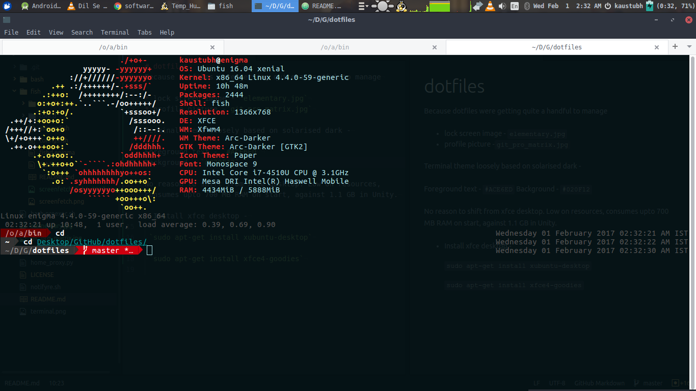

# fish

A user friendly command line shell . Read more about it [here](https://github.com/kaustubhhiware/awesome-ubuntu/#customising-terminal) for some resources.

Go to github > bobthefish and install nerdy fonts.

`fisherman` folder placed here

The default location is ` ~/.config/fish/config.fish`

### Screenshot
A newly launched terminal looks like this.

