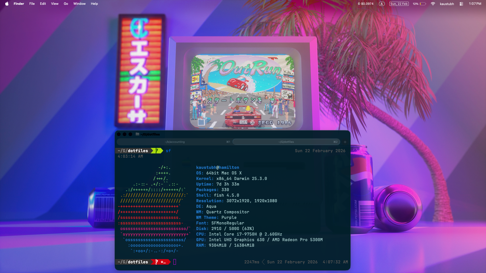
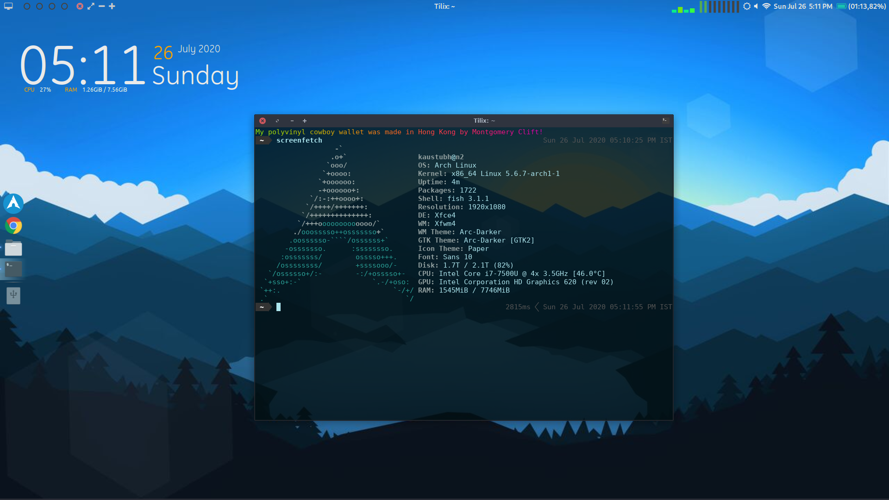

# images

2 files intentionally unnamed, so that the timestamp is preserved.

## What is

./Screenshot_2026-02-22_at_1.07.54 PM.png

## What was

Aka, the user can uninstall Arch, but how will you uninstall Arch from the user. I _used_ Arch btw.

./Screenshot_2020-07-26_17-11-59.png

